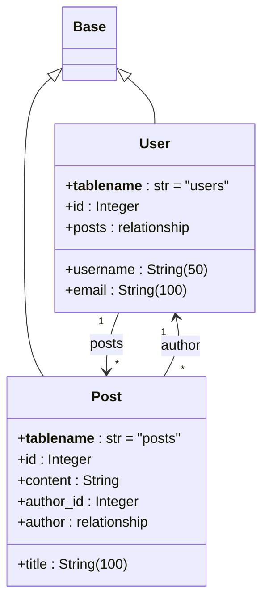

```mermaid
classDiagram
    class Base {
    }

    class User {
        +__tablename__ : str = "users"
        +id : Integer
        +username : String(50)
        +email : String(100)
        +posts : relationship
    }

    class Post {
        +__tablename__ : str = "posts"
        +id : Integer
        +title : String(100)
        +content : String
        +author_id : Integer
        +author : relationship
    }

    Base <|-- User
    Base <|-- Post
    User "1" --> "*" Post : posts
    Post "*" --> "1" User : author
```