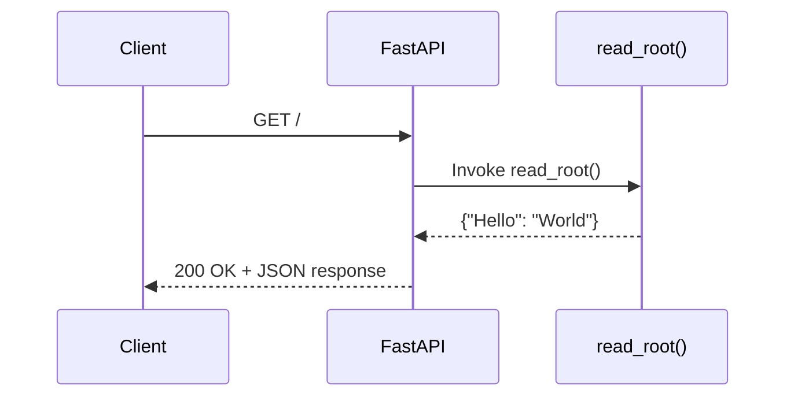

```mermaid
sequenceDiagram
    participant Client
    participant FastAPI
    participant RootHandler as read_root()
    
    Client->>FastAPI: GET /
    FastAPI->>RootHandler: Invoke read_root()
    RootHandler-->>FastAPI: {"Hello": "World"}
    FastAPI-->>Client: 200 OK + JSON response
```