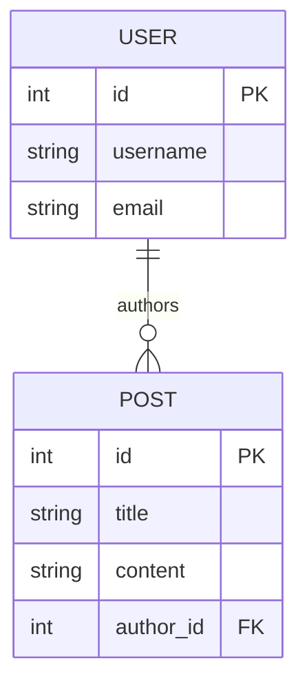

# Data Models (ERD)

Generated ERD diagram (Mermaid):

```mermaid
erDiagram
    USER ||--o{ POST : authors

    USER {
        int id PK
        string username
        string email
    }

    POST {
        int id PK
        string title
        string content
        int author_id FK
    }
```
