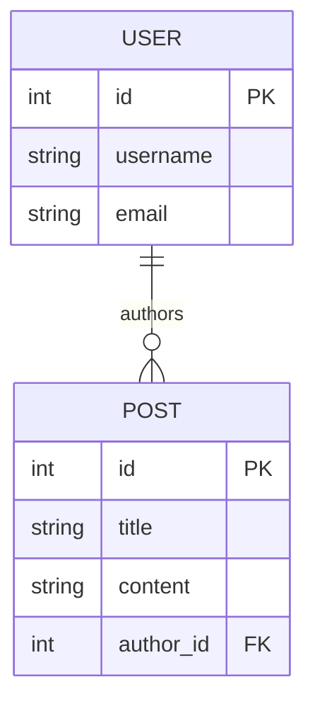
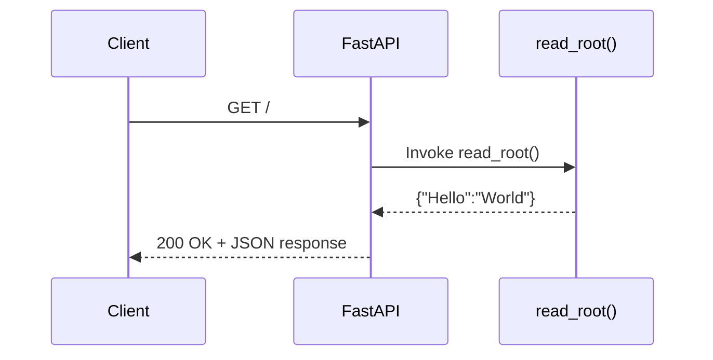

# Generated Documentation

Generated ERD diagram (Mermaid):

```mermaid
erDiagram
    USER ||--o{ POST : authors

    USER {
        int id PK
        string username
        string email
    }

    POST {
        int id PK
        string title
        string content
        int author_id FK
    }
```

Generated Sequence diagram (Mermaid):

```mermaid
sequenceDiagram
    participant Client
    participant FastAPI
    participant RootHandler as read_root()

    Client->>FastAPI: GET /
    FastAPI->>RootHandler: Invoke read_root()
    RootHandler-->>FastAPI: {"Hello":"World"}
    FastAPI-->>Client: 200 OK + JSON response
```
